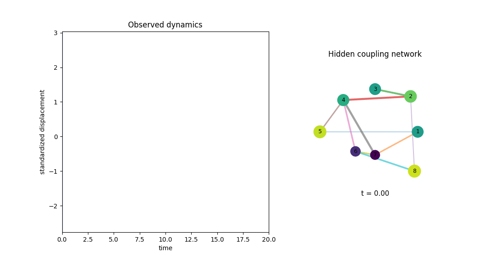
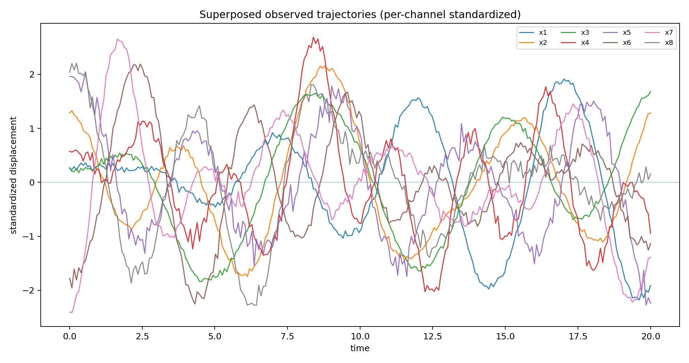
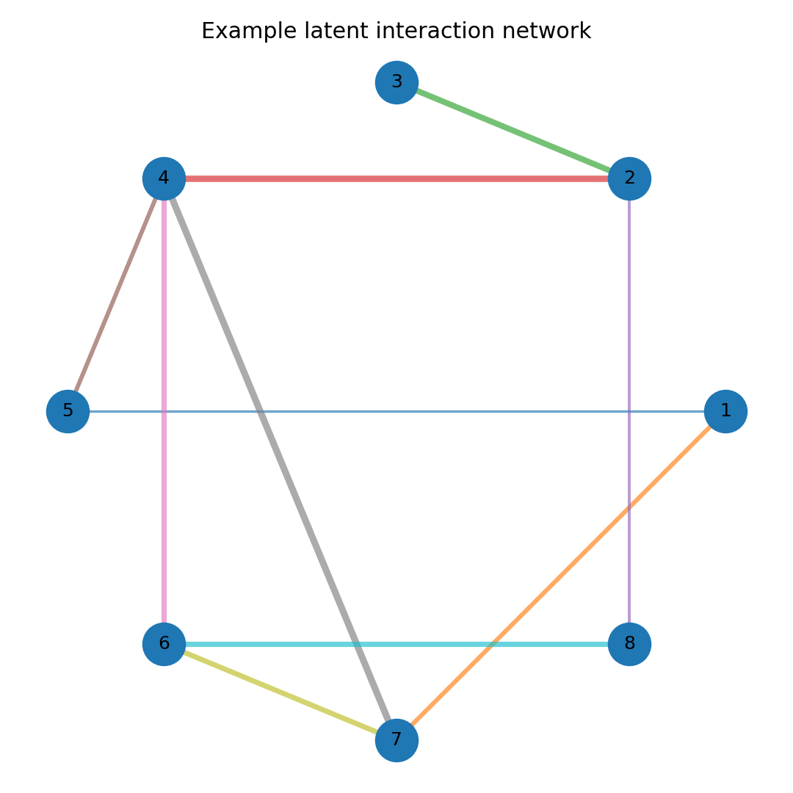
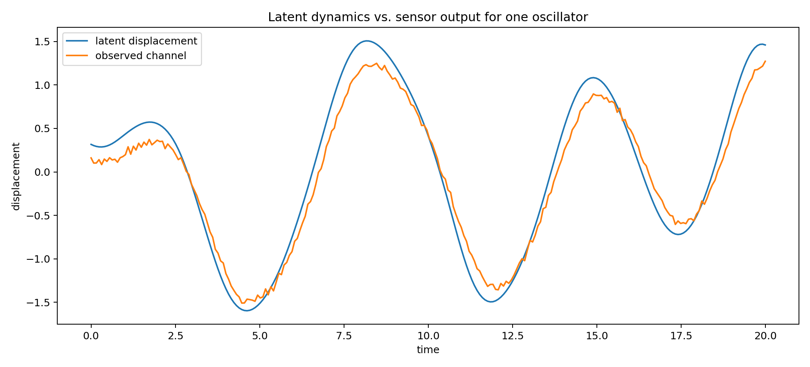

# Oscillator Network Inference

**Scientific ML / inverse problems / dynamical systems**

This repository is a clean-room reconstruction of a model-evaluation benchmark I worked on around a difficult inverse problem: **recovering the hidden interaction network of a nonlinear stochastic dynamical system from short, noisy multivariate trajectories**.

The public reconstruction contains the physical data-generating process, reproducible simulation code, the two model families used in the final solution, the four-member ensemble logic, the evaluation metric and visualization scripts. It does **not** contain the original task template, private evaluation data, prompts, grader code or proprietary artifacts.

<p align="center">
  
</p>

<p align="center"><em>Eight noisy observed channels evolving over the hidden interaction graph.</em></p>

<p align="center">
  
</p>

<p align="center">
  
</p>

## The inverse problem

Each experiment contains eight coupled oscillators. Only their measured displacement trajectories are observed. The goal is to infer the 28 independent entries of a symmetric coupling matrix

$$
K \in \mathbb{R}^{8\times 8}, \qquad K_{ij}=K_{ji}, \qquad K_{ii}=0,
$$

from a recording

$$
X = \{x_1(t),\ldots,x_8(t)\}, \qquad t\in[0,20],
$$

with 256 samples per channel.

This is not simple correlation recovery. The oscillators have heterogeneous local dynamics, the interaction law varies between experiments, the system is continuously driven by coloured stochastic forcing and the measured channels are distorted by an experiment-specific sensor model.

## Dynamical system

For oscillator $i$, the state satisfies

$$
\dot{x}_i=v_i,
$$

$$
\dot{v}_i=f_i(x_i,v_i)+1.5\sum_{j\neq i}K_{ij}h_c(x_j-x_i)
+\delta_{i,d}A\cos(\omega t)+\eta_i(t).
$$

The local law $f_i$ is sampled independently for each node from three nonlinear families:

**Duffing**

$$
f_i=-\gamma_i v_i-a_i x_i-b_i x_i^3
$$

**Van der Pol**

$$
f_i=-\mu_i(x_i^2-1)v_i-a_i x_i
$$

**Pendulum-like**

$$
f_i=-\gamma_i v_i-a_i\sin(x_i).
$$

The pairwise interaction is also experiment-dependent:

$$
h_c(\Delta x) =
\begin{cases}
\dfrac{\tanh(c\Delta x)}{c}, & \text{tanh interaction} \\
\dfrac{\sin(c\Delta x)}{c}, & \text{sine interaction} \\
\dfrac{\Delta x}{1+(c\Delta x)^2}, & \text{rational interaction}
\end{cases}
$$

The coupling graph is sparse, connected and non-negative. Experiments are drawn from both unstructured and modular/hub-like graph families while preserving the same edge-count and weight distributions.

## Stochastic forcing and observation model

Each oscillator receives Ornstein-Uhlenbeck forcing,

$$
d\eta_i=-\frac{\eta_i}{\tau_c}dt+\sigma\sqrt{\frac{2}{\tau_c}}dW_i,
$$

and exactly one node receives an additional sinusoidal drive.

The latent trajectories are not observed directly. The measurement pipeline applies:

1. first-order low-pass sensor response,
2. distance-dependent channel cross-talk,
3. per-channel gain and offset,
4. slow linear drift,
5. additive observation noise.

This makes zero-lag channel correlation an unreliable proxy for physical coupling.

<p align="center">
  
</p>

## Dataset generation

The reconstruction keeps the final benchmark scale and geometry:

- **8 oscillators** per experiment
- **28 coupling targets**
- **256 time samples** over $[0,20]$
- four balanced dynamical/graph regimes
- heterogeneous node physics
- interaction sharpness varying by experiment
- coloured process noise and noisy sensor measurements

The original benchmark used **48,000 training experiments** and a 400-row labelled validation set. The generator in this repository can produce an arbitrary number of independent experiments without relying on the original data files.

Generate a small dataset:

```bash
python -m data_generation.generate_dataset \
  --samples 2000 \
  --seed 1234 \
  --output data/train.npz
```

## Model 1 — PairContextNet

The first family treats the 28 candidate couplings as structured edges rather than unrelated regression targets.

For every channel it builds a temporal representation from:

- standardized displacement,
- first differences,
- normalized time,
- channel-scale statistics.

Residual dilated 1-D convolutions encode each trajectory. Candidate edge representations are then built from both endpoint embeddings and their difference. Short-lag cross-correlations of displacement and velocity-like features provide an additional dynamical cue.

Finally, self-attention over the 28 candidate edges allows each coupling estimate to use information from the entire inferred graph.

The final ensemble retains two independently trained checkpoints from this family: **C3** and **C4**.

## Model 2 — EdgeFirstAccNet

The second family was introduced to capture complementary information that the pair-context models were missing.

Instead of compressing node trajectories first, it constructs all **56 directed candidate edges** and explicitly feeds acceleration-sensitive temporal features:

$$
[x,\;\Delta x,\;\Delta^2 x,\;t].
$$

The network uses:

- node temporal convolutions,
- directed pair features $[h_i,h_j,h_j-h_i,h_i\odot h_j]$,
- temporal attention,
- edge/context attention across the candidate graph,
- symmetrization of $i\to j$ and $j\to i$ into the final 28 couplings.

The final configuration is

```text
channels       = 32
edge channels  = 64
model width    = 192
attention      = 4 layers × 8 heads
dropout        = 0.10
```

Two fine-tuned checkpoints from this family are used in the final predictor: **ACCFT17** and **ACCFT29_30**.

## Final four-model ensemble

The strongest solution combined complementary models rather than selecting a single checkpoint:

| Member | Family | Weight | Validation mean SRE |
|---|---|---:|---:|
| C3 | PairContextNet | 0.15 | 0.38684 |
| C4 | PairContextNet | 0.15 | 0.38790 |
| ACCFT17 | EdgeFirstAccNet | 0.35 | 0.36273 |
| ACCFT29_30 | EdgeFirstAccNet | 0.35 | — |
| **Final ensemble** | **mixed** | **1.00** | **0.34934** |

These values are the recorded results from the final benchmark run. The original trained checkpoints are not redistributed in this public reconstruction, so the table should be read as the experiment record rather than as a claim that the included untrained models reproduce the score out of the box.

Inference also uses **sign-flip test-time augmentation**:

$$
\hat K(X)=\frac{1}{2}\left[f(X)+f(-X)\right].
$$

The ensemble prediction is

$$
\hat K = 0.15\hat K_{C3}+0.15\hat K_{C4}
+0.35\hat K_{ACCFT17}+0.35\hat K_{ACCFT29\_30}.
$$

The final public-validation score was

$$
\boxed{\mathrm{mean\ SRE}=0.34934}
$$

on the 400-experiment validation population used during the final benchmarking iteration.

## Metric

Each coupling is scored independently with population-standardized RMSE:

$$
\mathrm{SRE}_k=
\frac{
\sqrt{\frac{1}{N}\sum_n(\hat y_{nk}-y_{nk})^2}
}{
\mathrm{std}(y_{:k})
}.
$$

The reported score is the equal-weight mean over all 28 targets. Lower is better. A constant predictor close to the population mean is therefore near SRE $\approx1$, while useful models must recover a substantial fraction of the latent interaction structure.

## Repository structure

```text
nonlinear-oscillator-coupling/
├── data_generation/
│   ├── system.py
│   └── generate_dataset.py
├── models/
│   ├── pair_context.py
│   ├── edge_first_acc.py
│   └── ensemble.py
├── training/
│   └── train_member.py
├── evaluation/
│   ├── metrics.py
│   └── evaluate_ensemble.py
├── visualization/
│   ├── make_figures.py
│   ├── make_extra_visuals.py
│   └── figures/
├── results/
│   └── validation_summary.csv
├── ensemble_config.json
└── README.md
```

## Reproducing the figures

Static scientific figures:

```bash
python -m visualization.make_figures
```

Animated and superposed trajectory visualizations:

```bash
python -m visualization.make_extra_visuals
```

Generated assets are written to `visualization/figures/`, including:

- `oscillator_dynamics.gif` — animated trajectories alongside the latent coupling graph
- `superposed_trajectories.png` — all eight standardized observed channels on a common axis
- `observed_trajectories.png` — offset multichannel view
- `latent_vs_observed.png` — latent state compared with its sensor-corrupted observation
- `interaction_network.png` — example hidden weighted graph
- `coupling_matrix.png` — ground-truth coupling matrix

## Training

Example pair-context member:

```bash
python -m training.train_member \
  --data data/train.npz \
  --architecture pair_context \
  --epochs 30 \
  --seed 3 \
  --output checkpoints/C3.pt
```

Example acceleration-aware member:

```bash
python -m training.train_member \
  --data data/train.npz \
  --architecture edge_first_acc \
  --epochs 30 \
  --seed 17 \
  --output checkpoints/ACCFT17.pt
```

The checkpoint labels in this repository preserve the names used during the original experiment log; they should not be interpreted as a formal description of the training seed or epoch unless explicitly specified.

## Why this problem is interesting

The central difficulty is not forward simulation. It is **system identification under nuisance transformations**: the desired interaction graph is latent, the local dynamics vary between nodes, the forcing is stochastic, and the sensor itself mixes and distorts the channels.

That combination makes the project a useful example of the intersection between:

- nonlinear dynamics,
- inverse problems,
- scientific machine learning,
- graph representation learning,
- robust model evaluation.

## Public reconstruction note

This repository is intentionally written as a standalone scientific project. The implementation is a clean reconstruction of the physical problem and modelling approach and is not a copy of the original evaluation environment. No private challenge labels or original task instructions are included.
